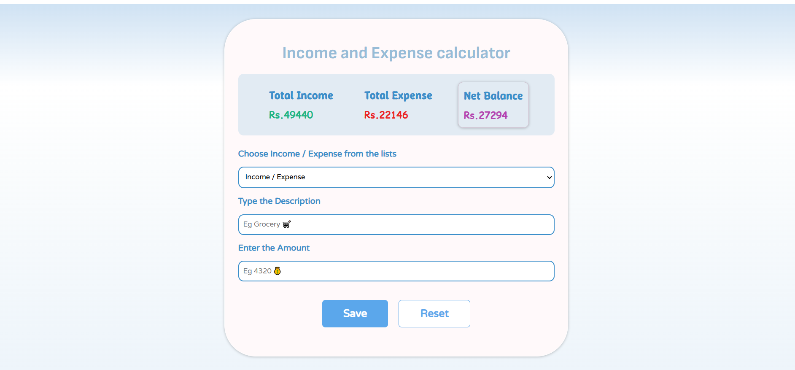
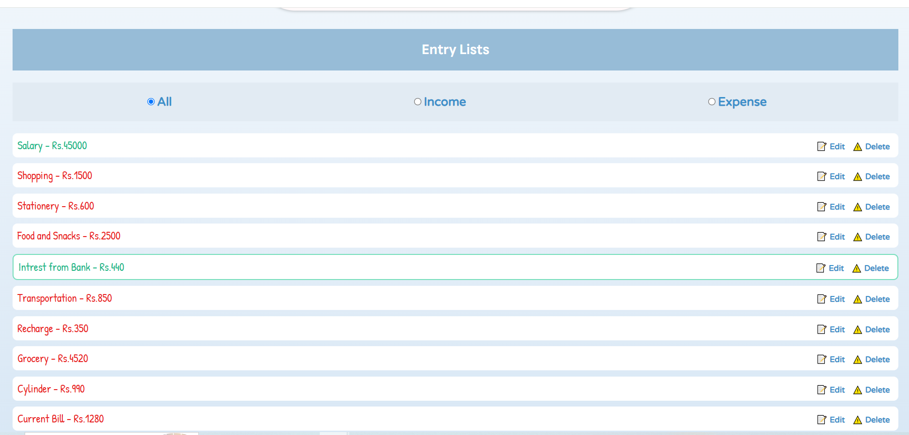
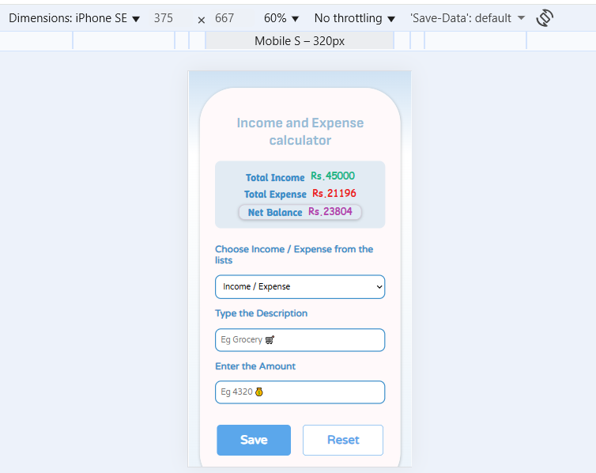
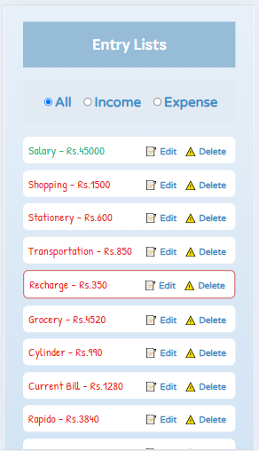

# Income and Expense Calculator
1. **A simple and interactive Income and Expense Calculator built using HTML, CSS, and JavaScript.**
2. **This web app allows users to track their income, expenses, and net balance with a clean, responsive design.**
3. **The user entries data are stored using localStorage.**

# Features
1. Total Income, Total Expense and Net Balance will be displayed on the top-center of the web Page and it is updated after each entry is saved.
2. Total Income amount will be displayed in ***green*** color, Total Expense amount will be displayed in ***red*** color and Net Balance amount will be displayed in ***purple*** color for better appearance and rememberance.
3. After entering description and amount , ***Save*** button is used to save the entry and ***Reset*** button is used to clear the current entry in active.
4. Filter option is available to view only income entries or only expense entries among all entries that are visible under "*ENTRY LISTS*".
5. Entries can be edited if its need to be rectified by clicking ***📝 Edit*** or it can be deleted by clicking ***⚠️ Delete*** once saving the entry is done.
6. Responsive design with smooth UI styling and interactive hover effects with different fonts styles, works on both desktop and mobile devices.
7. Entries are *auto-saved* even after refreshing the page using Localstorage functionality to persist data across sessions. 

# How CRUD Operations works to manage data
1. **Create** - Allows users to add new income and expense entries.  
2. **Read** - Displays the list of entries dynamically.  
3. **Update** - Enables users to edit existing entries.  
4. **Delete** - Provides functionality to remove entries from the list.  

# Techstacks used and files included
1. HTML <=> `index.html` for Structure or Contents of the webpage.
2. CSS <=> `style.css` for Styling and Designing of the content.
3. JS <=> `script.js` for applying Logic and CRUD operations.

# How It Works
1. ***Select*** the option from drop-down list as ***Income*** or ***Expense***.  
2. ***Type a description*** (Eg.Grocery,Shopping,Food,Travel,etc) and ***Enter amount*** (only in numbers).  
3. Click ***Save*** button to add the entry and by clicking ***Reset*** button the active entry is cleared.
4. By clicking the ***radio-button*** it filters out of three options either all entries or income entries or expense entries viewed separately. 
5. Income entries and Expense entries will be displayed in ***Green*** & ***Red*** colors below ENTRY LIST and it can be edited or deleted. 
6. The total income amount, total expense amount and net balance amount will be displayed on top-center of screen and it is automatically updated after each entries are saved.

# Preview
**Desktop View** and **Mobile view**
1. 
2. 
3. 
4. 

